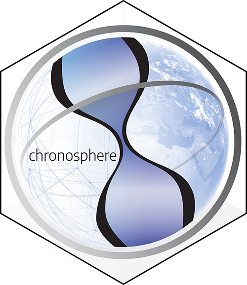

```{r setup, include=FALSE}
knitr::opts_chunk$set(echo = TRUE)

library(badger)
```

# chronosphere 

`r badge_devel("adamkocsis/chronosphere", "green")`
`r badge_cran_release("chronosphere", "orange")`
`r badge_cran_download("chronosphere", "grand-total", "yellow")`
`r badge_cran_checks("chronosphere")`
[](https://doi.org/10.5281/zenodo.3525481)


Evolving Earth System Data

The purpose of the 'chronosphere' project is to facilitate reproducible analyses of deep time paleoenvironmental/paleoecological research. 

The implemented functions allow the query, download, and import of remotely-stored and version-controlled data items. The inherent meta-database maps data files and import code to programming classes and allows access to these items via files deposited in public repositories. The purpose of the project is to increase reproducibility and establish version tracking of results from (paleo)environmental/ecological research.

This is a release candidate version. Much of the functionality is not yet available/perfect and data access is restricted to publicly available datasets only. 

# Installing

## Stable version

The stable version of the package is available from the CRAN repositories, which you can instal with this line, after you open R:

```r
install.packages("chronosphere")
```

## In development version

The devel-version can be installed from the source archive deposited on this github repository. Open R and paste in: 
```r
install.packages("https://github.com/chronosphere-portal/assets/raw/main/archive/r_client/chronosphere_0.5.0.tar.gz", repos=NULL, type="source")
```

## After install
You should be able to attach it with the regular library function:
```r
library(chronosphere)
```

# Usage

Run datasets() to see the publicly available variables. 

# Cite as
Kocsis, Ádám T. & Raja, Nussaïbah B. (2023). chronosphere: Evolving Earth System History Variables (Version 0.5.0). Zenodo. https://doi.org/10.5281/zenodo.3525481

