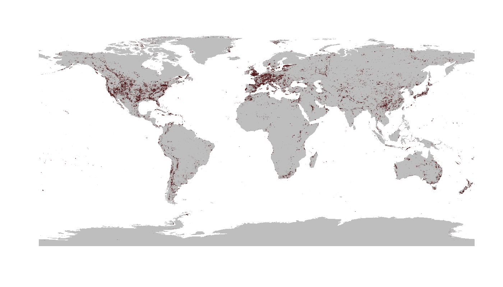

```{r setup, include=FALSE}
knitr::opts_chunk$set(echo = TRUE)

library(badger)
```

# chronosphere 


`r badge_devel("chronosphere-info/r_client", "green")`
`r badge_cran_release("chronosphere", "blue")`
`r badge_cran_download("chronosphere", "grand-total", "yellow")`
`r badge_cran_checks("chronosphere")`  

### Evolving Earth System Variables for <a href="https://www.r-project.org/"></a>

<br>

## Client package 
* * *

The implemented functions allow the query, download, and import of remotely-stored and version-controlled data items. The inherent meta-database maps data files and import code to programming classes and allows access to these items via files deposited in public repositories. The purpose of the project is to increase reproducibility and establish version tracking of results from (paleo)environmental/ecological research.

<div class="alert alert-warning"> <strong style="font-size: 25px">Important!</strong>
<hr>

<p>
Please note that the primary entities were renamed as part of the update to **v0.6.0**. The changes are: </p>
<ul>
<li> database ⮕ source (<strong>dat</strong> ⮕ <strong>src</strong>) </li>  
<li>variable ⮕ series (<strong>var</strong> ⮕ <strong>ser</strong>) </li> 
<li> 'data' ⮕ product </li>  
</ul>

<p>
These changes were necessary so formal variables can be introduced, which will allow the connection of data products that come from different sources. <strong>These are not intended to be changed in the future. </strong> </p>

 </div>

<br>

## Example
* * *

#### Distribution data

```{r introREAL, include=FALSE}
## library(chronosphere)

## # see available datasets
## available <- datasets()

## # download some data
## # NaturalEarth land polygons
## ne <- chronosphere::fetch("NaturalEarth", ser="land", ver="4.1.0")

## # The entire Paleobiology Database
## pbdb <- chronosphere::fetch("pbdb", ver="20230814")

## # collections
## colls <- unique(pbdb[, c("collection_no","lng", "lat")])

## # plot records
## png("man/figures/chronosphere_example.png", width=1400, height=800)
## plot(ne$geometry, col="gray", border=NA)
## points(colls$lng, colls$lat, cex=0.3, pch=16, col="#54121212")
## dev.off()
```

```{r intro, eval=FALSE}
library(chronosphere)

# see available datasets
available <- datasets()

# download some data
# NaturalEarth land polygons
ne <- chronosphere::fetch("NaturalEarth", ser="land", ver="4.1.0")

# The entire Paleobiology Database
pbdb <- chronosphere::fetch("pbdb", ver="20230814")

# collections
colls <- unique(pbdb[, c("collection_no","lng", "lat")])

# plot records
plot(ne$geometry, col="gray", border=NA)
points(colls$lng, colls$lat, cex=0.3, pch=16, col="#54121212")
```



<br>


## Notes 
* * *

#### Planned updates

The following updates are currently scheduled:  
- Access to variables: grouping entites that link data series together.  
- Access to datafiles via a secondary URL.   
- Using `datafiles` for the offline structuring of the downloaded files.  
- Webpages for individual data series.  

#### History

The original chronosphere was a true **monolith** that included lots of additional functionality to manipulate paleoenvironmental data. For better compliance with [UNIX philosophy](https://en.wikipedia.org/wiki/Unix_philosophy) and more efficient distribution/development, the original package has been split to multiple R packages:

- [`chronosphere`](https://chronosphere.info/r_client/): version-controlled data distribution.
- [`rgplates`](https://adamkocsis.github.io/rgplates/): functions related to tectonic reconstructions.
- [`via`](https://adamkocsis.github.io/via/): Virtual Arrays for efficient organisation of high-dimensional data.

This is a beta version, and like R, comes with absolutely no warranty.


